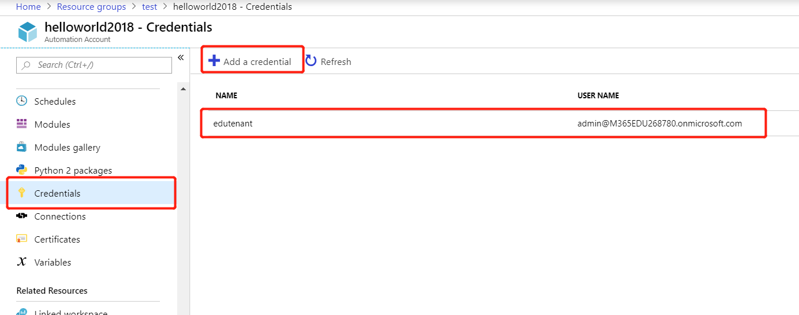
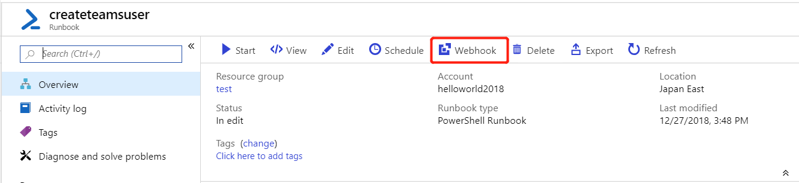
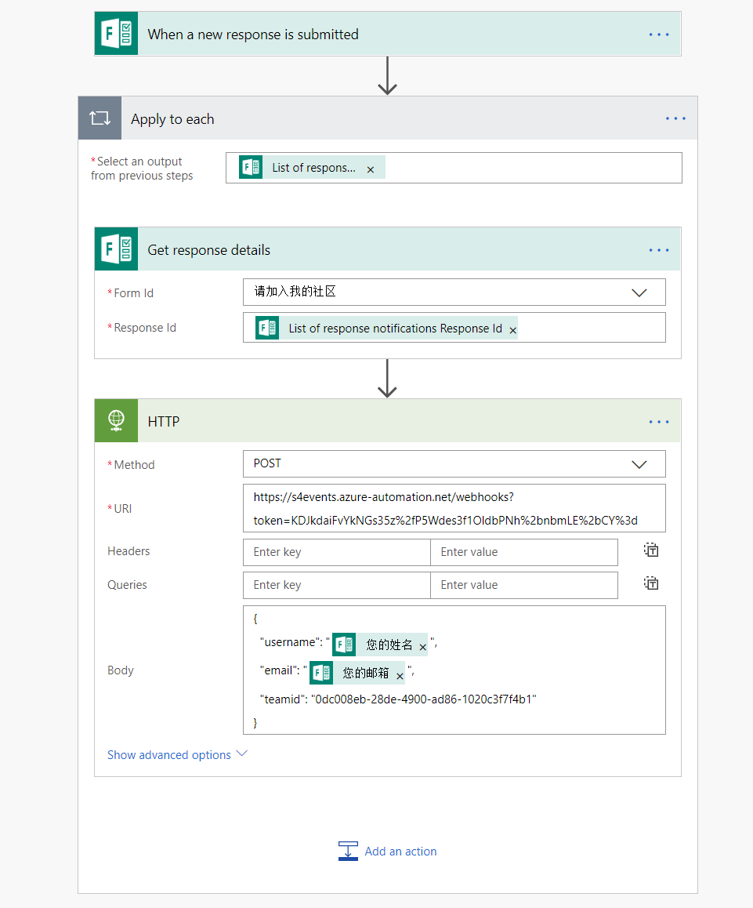

# Microsoft Teams 开源脚本库

> 陈希章 | 2018-11-19  

## 概述

这是我创建的一个新的开源项目，专门针对Microsoft Teams开发的一些脚本。这些脚本可能是用于辅助功能，也可能是用自动化的方式来进行Teams调用的。脚本类型包括但不限于PowerShell，Python等。

## 【本地方案，自动或半自动】根据Forms表单的结果，将用户添加到Teams中

这是一个PowerShell脚本，起初是为了解决我自己的需求。我为所有感兴趣加入社区的朋友准备了一个表单 <https://aka.ms/jointeamsdevcommunity> ，用来提交姓名和邮件地址，一开始人不是很多的时候，我是手工添加用户的，但后来越来越多，工作量也比较大，所以我定义了一个脚本，用来自动化根据Forms表单的结果将用户添加到Teams中来。该脚本的详细说明请参考 [AddUsersToTeams.ps1](AddUsersToTeams.ps1) .

> **请注意，这个脚本可以实现批量创建账户，如果你将该脚本通过Windows的任务计划设置定期运行，则可以实现自动化。但如果你的账号启用了MFA，则无法实现完全自动化，每次执行时你需要手动地输入账号**

下面这个是我的Forms表单范例


运行成功后，**你可能需要等待三个小时左右**，相关用户会自动加入到Team里面来（这个时间延迟是后台AAD的账号同步）


## 【云端，完全自动化】根据用户填写表单，依次创建Teams账号

上面这个脚本是批量创建用户账号。这个脚本还有一个小问题，就是如果之前加入过的用户，中途自己退出了，可能在下次脚本运行时还会邀请他加入。我下面实现的方式是可以在用户填表的时候，一个一个地加入账号，这样就可以避免上述问题了。

为了监控用户填写Forms表单的行为，我们可以通过Flow来做。但是在此之前，我们要有一个能自动根据Flow的调用执行的脚本，显然这个脚本是不能放在本地的。如何在云端有一个运行PowerShell的环境，并且能支持远程调用呢？答案是：Azure Automation。

关于Azure Automation的基本知识，已经超出了本文的讨论范围，有兴趣的朋友可以参考 <https://azure.microsoft.com/zh-cn/services/automation/> 的介绍。


我给大家创建的一个示例脚本（Runbook）是这样的

```powershell
# 定义参数
param (
    [object] $WebhookData
)

# 参数解析
$data = ConvertFrom-Json $WebhookData.RequestBody

# 抽取参数
$username =$data.username
$email =$data.email
$teamid =$data.teamid

# 将要用来执行的账号预先定义在Azure里面，避免明文定义在脚本中，请注意该账号也不能启用MFA
$credential = Get-AutomationPSCredential -Name 'edutenant'

# 连接到环境
Connect-AzureAD -Credential $credential
Connect-MicrosoftTeams -Credential $credential

# 创建邀请链接
New-AzureADMSInvitation -InvitedUserEmailAddress $email -InvitedUserDisplayName $username -InviteRedirectURL https://teams.microsoft.com/ -SendInvitationMessage $true -ErrorAction SilentlyContinue

#添加用户到Teams
Add-TeamUser -GroupId $teamid -User $email
```

上面有一个步骤很有意思，就是你可以将执行账号定义在Azure里面，而不需要在脚本中明文编写。这个操作是要在Azure Automation账号的Credentials配置中实现。



另外需要注意的是，因为这是一个云端环境，所以你需要引用的一些PowerShell Module 可以通过在Azure Automation 账号的Module Gallery中导入。


最后，为了让这个脚本能够被外部调用，你可以选择将其发布成为一个WebHook，你会得到一个HTTP 的访问地址。



酷！现在是时候回到Flow里面来啦，你可以通过内部的组件监控Forms的表单填写行为，然后将用户填写的信息读取出来，然后调用上面提到的WebHook就可以了。



> 这个Flow的范例，你可以通过 [这里](resources/flowsample.zip) 下载

大功告成了，这个方案中我们使用了Forms，Flow，Azure Automation等多项技术，完整地实现了一个根据用户填表自动创建Teams用户的机制。

## Microsoft Teams 社区

欢迎扫描二维码或者点击链接 <https://aka.ms/jointeamsdevcommunity> 加入Microsoft Teams 技术社区

